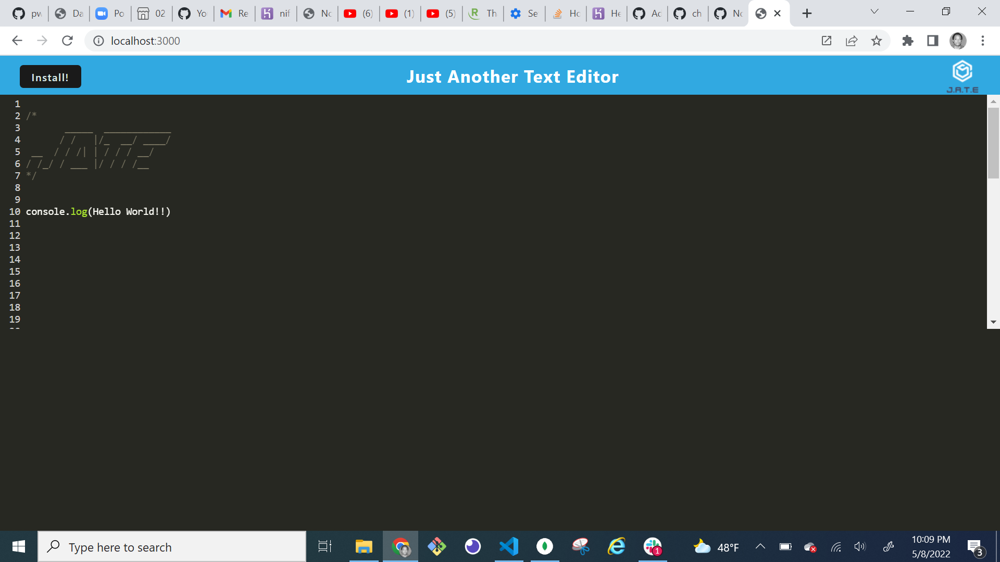

# Text-Editor
To build a text editor that runs in the browser

# Description
The following  web application that is a JavaScript text editor. This app will utilize several techniques to persist data, it will use both local storage and the indexedDb webpack plugin to persist data between sessions.
# Technology Used
## JavaScript
## Node.js
## Express.js
## nodemon npm package
## Webpack.js

## Screenshot

